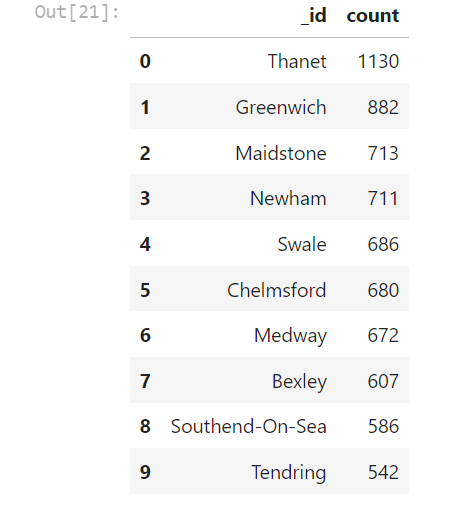

# NOSQL

To start the project, I followed these initial setup instructions:

1. Created a new repository named "nosql-challenge" specifically for this project.

2. Cloned the newly created repository to my local computer.

3. Added the Jupyter notebook starter files and the "establishments.json" file to the repository's folder.

4. Pushed the changes to GitHub.

## Part 1: Database and Jupyter Notebook Set Up

I used the Jupyter Notebook provided in the starter code folder named "NoSQL_setup_starter.ipynb" for this section of the challenge. The steps I followed were as follows:

1. Imported the data provided in the "establishments.json" file into a MongoDB database named "uk_food" and a collection named "establishments".

2. Confirmed the successful creation of the database and loading of the data by listing the databases and collections in MongoDB.

3. Retrieved and displayed one document from the "establishments" collection using the `find_one` method.

4. Assigned the "establishments" collection to a variable for further use.

## Part 2: Update the Database

I continued with the Jupyter Notebook "NoSQL_setup_starter.ipynb" for this section of the challenge. The modifications requested by the magazine editors were as follows:

1. Added a new halal restaurant, "Penang Flavours," to the database. The details of the new restaurant were provided, and I included them as a new document in the "establishments" collection.

2. Found the BusinessTypeID for "Restaurant/Cafe/Canteen" and returned only the BusinessTypeID and BusinessType fields.

3. Updated the newly added restaurant document with the BusinessTypeID found.

4. Checked the number of documents containing the Dover Local Authority and removed any establishments within the Dover Local Authority from the database.

5. Converted certain number values from strings to actual numbers using the `update_many` method.

## Part 3: Exploratory Analysis

To assist the food magazine editors, Eat Safe, Love, I conducted an exploratory analysis of the ratings data in the database. Here are some key findings:

1. Establishments with a hygiene score of 20:
   - There are 41 establishments with a hygiene score of 20.

2. Highly rated establishments in London:
   - There are 34 establishments in London with a rating value of 4 or higher.
 

3. Local Authority areas with the highest number of establishments with a hygiene score of 0:
   - The count of establishments with a hygiene score of 0, sorted from highest to lowest, in the top ten Local Authority areas is as follows: 

